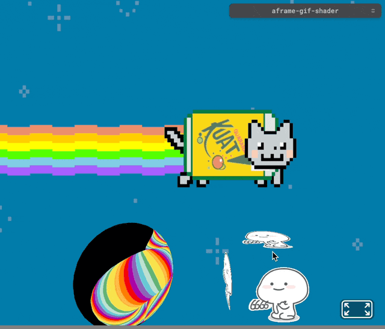

# AFrame GIF Shader

**A gif shader for [A-Frame](https://aframe.io) VR - v1.6.0**

[DEMO](https://ax.minicg.com/demo/aframe-gif-shader/index.html)



Inspired by:
- [@gtk2k - animation_gif](https://github.com/gtk2k/gtk2k.github.io/tree/master/animation_gif)
- [mayognaise - aframe-gif-shader](https://github.com/mayognaise/aframe-gif-shader/tree/master)

## Properties

| Property | Description | Default Value |
| -------- | ----------- | ------------- |
| src      | image url   | ""            |
| speed    | limited to 1 at the beginning, can change after init | 1 |
| play     | play or pause | true |


## Usage

### Browser

Install and use by directly including the [browser files](dist):

```html
<head>
  <title>My A-Frame Scene</title>
  <script src="https://cdn.jsdelivr.net/npm/aframe@1.6.0/dist/aframe-master.min.js"></script>
  <script src="aframe-gif-shader.min.js"></script>
</head>

<body>
  <a-scene>
    <a-entity geometry="primitive:box;" material="color:#ccc" gif-shader="src:image.gif; speed:2; play:true;"></a-entity>
  </a-scene>
</body>
```

### ES Module

```js
import 'aframe'
import 'aframe-gif-shader'
```